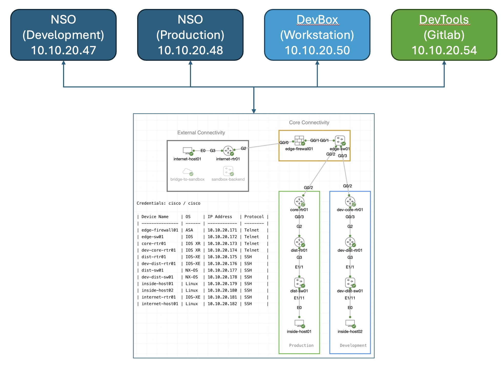

# Homepage

## Introduction to the Project
---
Don't worry—you don't need to build a project from scratch. Instead, you'll work with a sample project already set up in the sandbox.

In this project, you'll discover the real benefits of NetDevOps by exploring open testing and automation tools. You'll build your own setup and see how everything works together. The goal is to create a complete environment that demonstrates the following benefits across the network:

**Automation Tools**

* Set up a detailed testbed using pyATS, defining network topology and device specifics for automation.
* Extract network state information with pyATS parsers to facilitate analysis and decision-making.
* Gather comprehensive device configurations and operational data using pyATS device parsers.
* Design and implement focused tests to verify network elements and their interactions.
* Use Robot Framework for creating basic automation scripts to handle repetitive, non-network tasks.
* Develop and run network-specific test scripts to ensure the reliability and performance of the network.
* Integrate Robot Framework for advanced testing capabilities on NSO and network devices.

**NSO CI/CD Pipelines**

* Track the status of network configurations at any point in time.
* Track who proposed and approved each specific configuration change.
* Provide visibility into configuration differences at any point in time versus previous states.
* Enable rollback to any previous moment.
* Provide syntax-checking capabilities for network changes on your local workstation.
* Automate the deployment of proposed changes across different environments (e.g., testing, staging, production).
* Model simulated virtual environments to test proposed changes before going to production.
* Define and run the required test sets and passing criteria, both in testing and production, before accepting a change as successful.
* Automatically roll back any proposed configuration that does not pass the required tests.

---
These are the building blocks used for this comprehensive demonstration:

* [GitLab](https://about.gitlab.com/): Version Control Server (VCS) with integration capabilities for automated pipelines.
* [Cisco Network Services Orchestrator](https://developer.cisco.com/site/nso/): Provides end-to-end automation to design and deliver services faster.
* [pyATS](https://developer.cisco.com/pyats/): Automation tool for stateful validation of network device operational status with reusable test cases.
* [CML](https://www.cisco.com/c/en/us/products/cloud-systems-management/modeling-labs/index.html): Network modeling and simulation environment.
* [Robot](https://robotframework.org/): Open source automation framework for test automation and robotic process automation (RPA).

## Prerequisites
---
To follow this workshop, you should have:

- VPN Client for connection to dCloud (Cisco Secure Client)

## Lab Topology
---
Here's a brief outline of the dCloud setup used for this lab:

- **Access:** Connect through a Cisco Secure Client VPN, with details provided by your breakout proctor.
- **Network Setup:** Two Cisco Modeling Labs (CML) environments are available—one simulates the live network, and the other is for testing.
  - **Production NSO:** The main NSO deployment manages network devices within the CML.
- **Developer Workstation (DevBox):** A Linux VM for developing new services, running tests, and initiating pipelines.
- **Developer Tools (DevTools):** Another Linux VM equipped with various tools needed for lab activities.

