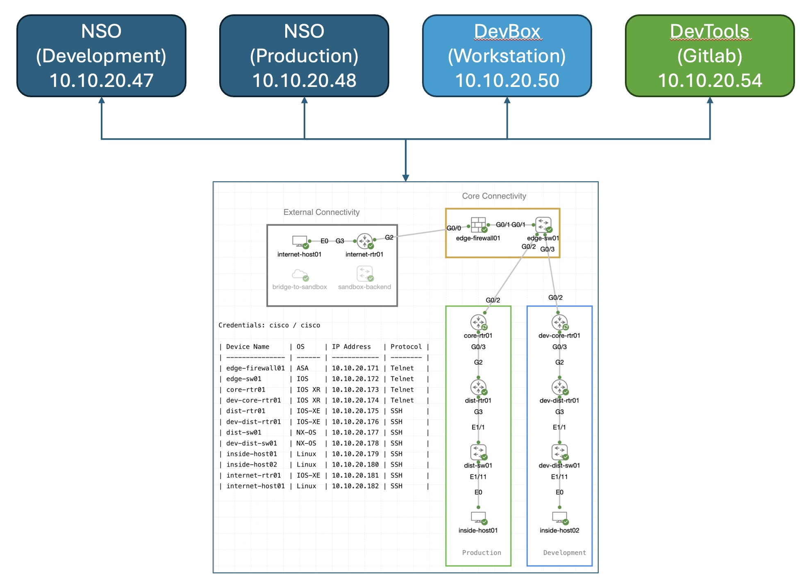

# Homepage

---
Don't worry - you are not expecting to come up with a project from the ground up. Instead, we'll be working on a small sample repository from the update NSO Sandbox.

In this project, you will get to know the real benefits of NetDevOps by knowing open testing automation tools and you will be building your own setup and seeing how it works. The goal will be to create a complete environment that demonstrates the following benefits across the whole network:

## Agenda

### Section 1: Introduction to CICD, Automation, and NSO Verification
In this section, we will introduce key concepts such as Continuous Integration and Continuous Deployment (CICD), automation, and the basics of NSO (Network Services Orchestrator). We will discuss source version control, with a focus on GitLab.

### Section 2: CICD Pipelines with NSO
This section will delve into the concept of a CICD pipeline. We will cover how to create, execute, and trigger these automated processes. Additionally, we will explore how CICD pipelines can be leveraged for the development and deployment of NSO service packages.

### Section 3: Automated Testing
In this section, we will discuss the role of automated testing within the CICD pipeline. We will demonstrate how to implement automated tests for NSO service packages to ensure that they meet the specified requirements and function correctly before deployment using Robot Framework and PyAts.

### Closure/Summary
In the final section, we will summarize the key points covered in the lab. We will highlight how implementing CICD concepts can improve the quality and reliability of new deployments by facilitating thorough testing and version control. This lab aims to provide a comprehensive understanding of how CICD can be effectively integrated into your development workflow to enhance automation and quality assurance.

## Lab Topology 
---
Here's a brief outline of the dCloud setup we'll use for this lab:

- **Access:** You'll connect through a Cisco Secure Client VPN, with details provided in the access page.
- **Network Setup:** We have two Cisco Modeling Labs (CML) environments. One simulates the live network, and the other is for testing.
Production NSO: This is the primary NSO deployment that manages the network devices within the CML.
- **Developer Workstation (DevBox):** A Linux VM designated for developing new services, running tests, and initiating pipelines.
- **Developer Tools (DevTools):** Another Linux VM equipped with various tools needed for the lab activities.
- **NSO Instances:** Two NSO 6.2.5 instances acting as development and production tools.

## Component Overview 

---
These are the building blocks we will use to provide such a comprehensive demonstration

* [Gitlab](https://about.gitlab.com/): Version Control Server (VCS) with integration capabilities to provide automated pipelines.
* [Cisco Network Services Orchestrator](https://developer.cisco.com/site/nso/): Formerly Tail-f, it provides end-to-end automation to design and deliver services much faster.
* [pyATS](https://developer.cisco.com/pyats/): Automation tool to perform stateful validation of network devices operational status with reusable test cases.
* [CML](https://www.cisco.com/c/en/us/products/cloud-systems-management/modeling-labs/index.html): Formerly VIRL, provides a network modeling and simulation environment.
* [Robot](https://robotframework.org/): Open source automation framework for test automation and robotic process automation (RPA).