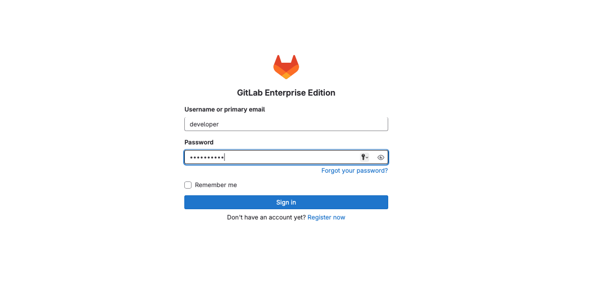
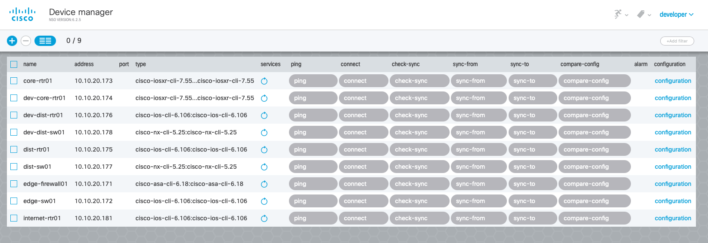

# Workshop Access & Login
## Verification
- **Access GitLab**: All the bookmarks for this sessions are available in Google Chrome, select DEVWKS-2618 Bookmark folder and Web IDE. (You can also  navigate to [http://devtools-gitlab.lab.devnetsandbox.local](http://devtools-gitlab.lab.devnetsandbox.local) to access the GitLab UI.) Log in with username `developer` and password `C1sco12345`.



## Examine NSO Deployment

In the Sandbox, there are three different instances of Cisco Network Services Orchestrator (NSO). These instances have been pre-provisioned with the necessary Network Element Drivers (NEDs) and configured to manage the devices in the lab topology.

For the purpose of this workshop, we will focus on two specific NSO environments:

**Development NSO:** `10.10.20.47`

**Production NSO:** `10.10.20.48`

The Development NSO environment (`10.10.20.47`) is used to simulate a testing environment where we can validate our changes before deploying them to the production environment. This ensures that any modifications are thoroughly tested and verified, reducing the risk of issues in the Production NSO environment (`10.10.20.48`).

### Log into NSO 
---
Launch an SSH session to the Dev NSO instance (`10.10.20.47`) and log in using username `developer` and password `C1sco12345`.
<details>
<summary>Click here to show solution</summary>
```bash
ssh developer@10.10.20.47
```
</details>

### Access the NSO shell 
---
Use the `ncs_cli` command to access the NSO command shell. The command prompt will change to `admin@ncs#`.

<details>
<summary>Click here to show solution</summary>
```bash
ncs_cli -Cu admin
```
</details>

### Display the devices 
---
The `show devices` command displays the devices in the sandbox topology that were provisioned in NSO during lab setup. We will be working with the Core and Distribution routers in this workshop. However, you can experiment with the other devices if you want.

<details>
<summary>Click here to show solution</summary>
```bash 
show devices list
```
</details>

Expected output:
```
NAME             ADDRESS       DESCRIPTION  NED ID                ADMIN STATE
-----------------------------------------------------------------------------
core-rtr01       10.10.20.173  -            cisco-iosxr-cli-7.55  unlocked
dev-core-rtr01   10.10.20.174  -            cisco-iosxr-cli-7.55  unlocked
dev-dist-rtr01   10.10.20.176  -            cisco-ios-cli-6.106   unlocked
dev-dist-sw01    10.10.20.178  -            cisco-nx-cli-5.25     unlocked
dist-rtr01       10.10.20.175  -            cisco-ios-cli-6.106   unlocked
dist-sw01        10.10.20.177  -            cisco-nx-cli-5.25     unlocked
edge-firewall01  10.10.20.171  -            cisco-asa-cli-6.18    unlocked
edge-sw01        10.10.20.172  -            cisco-ios-cli-6.106   unlocked
internet-rtr01   10.10.20.181  -            cisco-ios-cli-6.106   unlocked
```

### View devices in the NSO GUI 
---

Select the NSO bookmark in Google Chrome or navigate to [http://10.10.20.47:8080/](http://10.10.20.47:8080/) Log in using the username `developer` and password `C1sco12345`.

1. Navigate to the Device Manager tab to view the devices.
2. Ensure all devices are operational and correctly onboarded to NSO: select each device and run the Connect action.



If all steps are executed correctly, you will have completed the verification of your working environment.