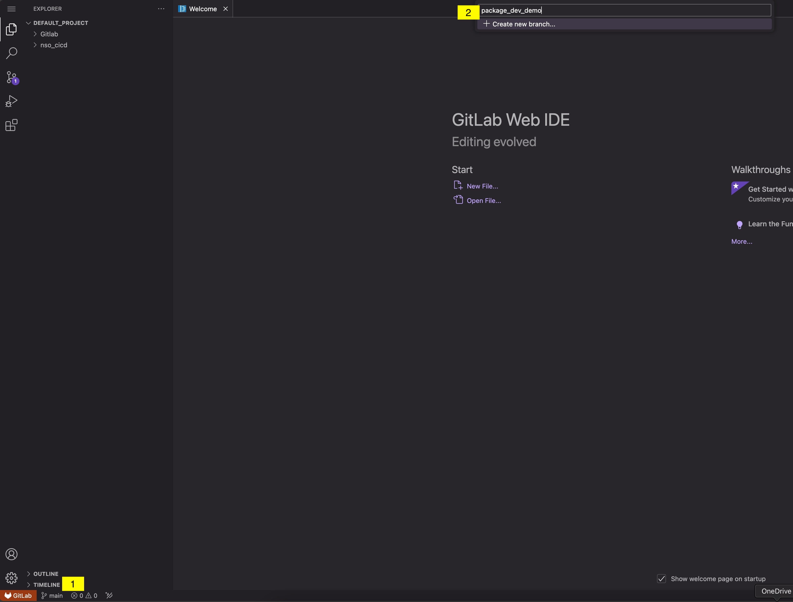
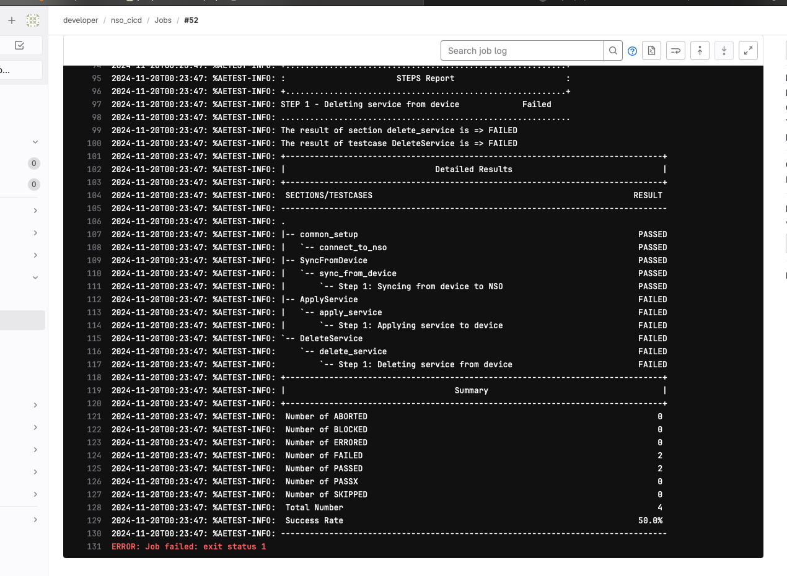

# Pipeline-Driven NSO Service Development 
---
After grasping the concept of a pipeline and its stages, we'll proceed to modify the NSO package service in the `nso_cicd/packages/loopback` directory. Our GitLab CI/CD pipeline will automate the verification process by compiling the package and conducting a compatibility check (smoke test) with the current NSO version. 

The pipeline will also automate the deployment of the package service in the NSO development environment and execute tests using Python and PyATS. Once all pipeline stages are successfully completed, we can confidently deploy the changes to the production environment.

## Task 3: Create a Test Branch

??? info "**Reminder:** What is a branch?"
    
    In Git, a branch is a lightweight, movable pointer to a commit. Branches are used to create separate lines of development within a repository, allowing you to work on different features, bug fixes, or experiments simultaneously without affecting the main codebase. Branches in Git provide a flexible and efficient way to manage code changes, enabling parallel development and easy collaboration. They are central to most version control workflows, allowing developers to experiment and innovate without disrupting stable code.
    
    **Key Concepts:**
    
    - **Default Branch:** When you initialize a new Git repository, a default branch is created, usually called main or master. This branch typically represents the main line of development or the production-ready code.
    - **Feature Development:** Developers create new branches for each feature, bug fix, or task. This isolates changes from the main branch until they are ready to be merged. For example, a feature branch might be named feature/new-user-auth.
    - **Branch Creation:** Branches are created using the git branch command or git checkout -b to create and switch to a new branch simultaneously.
    - **Switching Branches:** You can switch between branches using the git checkout command. This updates your working directory to match the state of the branch you checked out.
    - **Merging:** Once work on a branch is complete and tested, it can be merged back into another branch, typically the main branch, using the git merge command. This incorporates the changes from one branch into another.
    - **Collaboration:** Branches make it easier for multiple developers to collaborate on a project without interfering with each other's work. Each developer can work on their own branch and merge changes into shared branches as needed.

Creating a test branch allows us to make changes safely without impacting the production NSO service package stored in the main branch. By committing and pushing changes to this test branch in GitLab, the pipeline will automatically compile, test and deploy the NSO package to the development environment and execute the test scripts. Afterward, we can review the pipeline's pass/fail status to ensure the changes are successful.



You now should have a new branch called `package_dev_demo` and should be working on that branch.


## Task 4: Update NSO loopback template

??? info  "**Reminder:** What is a template and is it different to a model?"

    Together, YANG models and templates enable the full lifecycle management of network services-from design and deployment to monitoring and troubleshooting. This combination allows network operators to define services once and deploy them consistently across diverse network environments, scaling operations efficiently. YANG models and templates are integral to NSO's automation capabilities, allowing for rapid deployment and modification of network services, reducing the need for manual intervention.
    
    **Key Concepts:**
    
    - **Configuration Generation:** Templates in NSO are used to generate device-specific configuration snippets from the abstract service definitions provided by YANG models. They translate the abstract service data into concrete device commands or configurations.

    - **Device-Specific Customization:** While YANG models define the abstract structure, templates handle the nuances of various device types and vendors, allowing NSO to push the correct configurations to different devices.

    - **Separation of Concerns:** By using templates, NSO separates the service logic from device-specific syntax, allowing for easier maintenance and updates. This separation allows network operators to update configurations for specific devices without altering the core service logic.

    - **Reusable Components:** Templates can be reused across different services, promoting consistency and reducing duplication in configuration logic.


To complete the development of the Loopback service and ensure all tests pass, go and modify the file `loopback-template.xml` located in the directory `/nso_cicd/packages/loopback/templates`.  Include the XML configurations as specified below, making sure they match exactly:

!!!question "Question: Why do we need to define different interface templates for IOS and IOS XR?"

```xml 
<config-template xmlns="http://tail-f.com/ns/config/1.0"
                 servicepoint="loopback">  
  <devices xmlns="http://tail-f.com/ns/ncs">  
    <!-- DEVICE -->
    <device>  
      <name>{/device}</name>  
      <config>  
        <!-- IOS -->
        <interface xmlns="urn:ios"> 
          <Loopback> 
            <name>{/loopback-intf}</name>
            <ip> 
              <address> 
                <primary> 
                  <address>{/ip-address}</address>
                  <mask>255.255.255.255</mask> 
                </primary> 
              </address> 
            </ip> 
          </Loopback> 
        </interface> 
        <!-- IOS-XR -->
        <interface xmlns="http://tail-f.com/ned/cisco-ios-xr"> 
          <Loopback> 
            <id>{/loopback-intf}</id>
            <ipv4> 
              <address> 
                <ip>{/ip-address}</ip>
                <mask>255.255.255.255</mask> 
              </address> 
            </ipv4> 
          </Loopback> 
        </interface>  
      </config> 
    </device> 
  </devices> 
</config-template>
```

## Task 5: Update Gitlab Pipeline

It's now time to make our pipeline actually do something - for this workshop we're going to be using a pipeline to package an NSO loopback service, perform some validation and apply the service to a device.

To enhance practicality and efficiency in this workshop, you can replace your ci file with the pipeline below and commit changes. Don't worry too much about the detail of each task, if we have time at the end we can revisit the functions. 

!!!question "Question: Which stages will run when making changes in our test pipeline?"

```yaml linenums="1" title="Gitlab runner .gitlab-ci.yml"
include:
  - '/nso_cicd/pipeline_utils/environments.yml'

# Define the stages of the pipeline
stages:
  - build
  - test
  - deliver
  - deploy_prod

runner pre-reqs:
  stage: .pre
  when: on_success
  script:
    - apt update && apt install sshpass -y
    - python3 -m pip install robotframework-sshlibrary

# Step to compile the package in the development NSO environment
package-compilation-🔨:
  stage: build
  when: on_success
  except:
    - main
  script:
    - echo "(Build 🔨) Loading and compiling packages in the NSO dev container"
    # Copy the package to the NSO development environment
    - sshpass -p "$NSO_DEV_PWD" scp -o StrictHostKeyChecking=no -r nso_cicd/packages/$PACKAGE $NSO_DEV_USER@$NSO_DEV_IP:/home/developer/$PACKAGE
    # SSH into the NSO development environment and compile the package
    - sshpass -p "$NSO_DEV_PWD" ssh -o StrictHostKeyChecking=no $NSO_DEV_USER@$NSO_DEV_IP "
          cd /home/developer/ &&
          cp -r $PACKAGE /nso/run/packages &&
          source /opt/ncs/ncs-6.2.5/ncsrc &&
          cd /nso/run/packages/$PACKAGE/src &&
          make clean &&
          make"

# Step to load the compiled package into the testing NSO environment
package-load-📥:
  stage: build
  when: on_success
  except:
    - main
  script:
    - echo "(Build 📥) Loading compiled packages to testing env NSO"
    # SSH into the NSO development environment and reload the package
    - sshpass -p "$NSO_DEV_PWD" ssh -o StrictHostKeyChecking=no $NSO_DEV_USER@$NSO_DEV_IP "
      source /opt/ncs/ncs-6.2.5/ncsrc && 
      echo 'packages reload' | ncs_cli -Cu admin"

# Step to test the loopback service in the NSO testing environment
test-loopback-service-🕵🏽:
  stage: test
  when: on_success
  except:
    - main
  script:
    - echo "(Test 🕵🏽) Deploying service in the NSO test env"
    # Test the service on an IOS-XR device
    - echo "Test IOS-XR"
    - cd nso_cicd/tests/loopback-test && python3 loopback-test.py --nso_url "http://$NSO_DEV_IP:8080" --device "dev-core-rtr01" --username $NSO_DEV_USER --password $NSO_DEV_PWD
    # Test the service on an IOS device
    - echo "Test IOS"
    - python3 loopback-test.py --nso_url "http://$NSO_DEV_IP:8080" --device "dev-dist-rtr01" --username $NSO_DEV_USER --password $NSO_DEV_PWD

# Step to generate and publish the release package
release-publishing-📦:
  stage: deliver
  when: on_success
  except:
    - main
  script:
  - echo "(Deliver 📦) Generating zip" && 
   rm -rf package-artifact/$PACKAGE && 
   mkdir -p package-artifact
  # Copy the package from the NSO development environment to the local directory and create a tarball
  - sshpass -p "$NSO_DEV_PWD" scp -o StrictHostKeyChecking=no -r $NSO_DEV_USER@$NSO_DEV_IP:/nso/run/packages/$PACKAGE $PWD/package-artifact/$PACKAGE/ &&
    cd package-artifact/ && touch nso-package_$PACKAGE_$CI_COMMIT_REF_NAME.tar.gz && ls &&
    tar -czvf nso-package_$PACKAGE_$CI_COMMIT_REF_NAME.tar.gz . 
  artifacts:
    when: on_success
    paths:
     - $CI_PROJECT_DIR/package-artifact/nso-package_$PACKAGE_$CI_COMMIT_REF_NAME.tar.gz

# Step to clean up the development environment
cleanup-🗑️:
  stage: .post
  when: always
  allow_failure: true
  script:
    - echo "(Cleanup 🗑️) Removing files from NSO Dev"
    # SSH into the NSO development environment and remove the package files
    - sshpass -p "$NSO_DEV_PWD" ssh -o StrictHostKeyChecking=no $NSO_DEV_USER@$NSO_DEV_IP "
      rm -rf $PACKAGE &&
      rm -rf cd /nso/run/packages/$PACKAGE &&
      source /opt/ncs/ncs-6.2.5/ncsrc && echo 'packages reload force' | ncs_cli -Cu admin"


# Step to deploy the package to the production NSO environment
deploy-production-📬:
  stage: deploy_prod
  when: on_success
  only:
    - main
  script:
    - echo "(Deploy📬) Deployment in production."
    - cd package-artifact/ && ls
    # Copy the package tarball to the NSO production environment
    - sshpass -p "$NSO_PROD_PWD" scp -o StrictHostKeyChecking=no -r nso-package_$PACKAGE_$CI_COMMIT_REF_NAME.tar.gz $NSO_DEV_USER@$NSO_PROD_IP:/home/developer/nso-package_$PACKAGE_$CI_COMMIT_REF_NAME.tar.gz
    # SSH into the NSO production environment, extract the tarball, and reload the package
    - sshpass -p "$NSO_PROD_PWD" ssh -o StrictHostKeyChecking=no $NSO_DEV_USER@$NSO_PROD_IP "
        cd /home/developer/ &&
        tar -xvf nso-package_$PACKAGE_$CI_COMMIT_REF_NAME.tar.gz &&
        rm -rf *.tar.gz &&
        cp -r $PACKAGE /nso/run/packages/loopback &&
        source /opt/ncs/ncs-6.2.5/ncsrc &&    
        cd /nso/run/packages/$PACKAGE/src &&      
        make clean &&
        make &&
        echo 'packages reload' | ncs_cli -Cu admin"
```
> **Note:** For more details on the pipeline configuration see the GitLab [documentation](https://docs.gitlab.com/ee/ci/yaml/) 


Navigate to [http://devtools-gitlab.lab.devnetsandbox.local/developer/nso_cicd/-/pipelines](http://devtools-gitlab.lab.devnetsandbox.local/developer/nso_cicd/-/pipelines) in your web browser to view the status of the pipeline.

This process may take a few minutes to complete - while the stages are completing - take a look at those which are finished to see what is occuring.

!!! question "What was the outcome of the testing phase?"

!!! question "Is the loopback service available in the development NSO instance?"

<!-- todo: add picture of the stage and show the message why it fail -->



