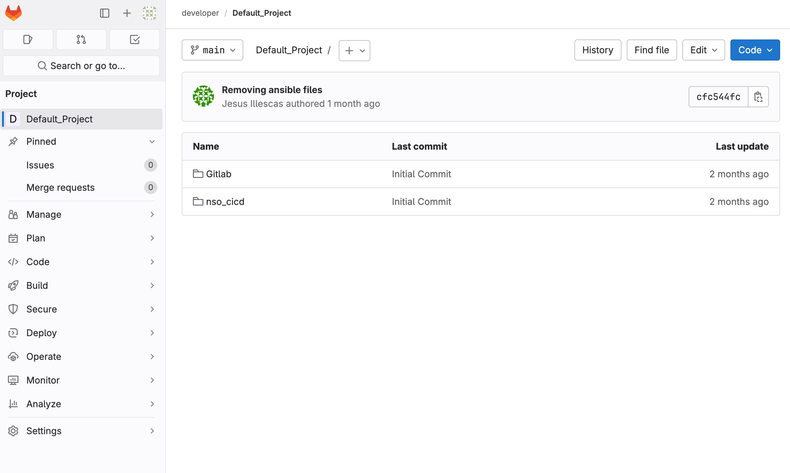
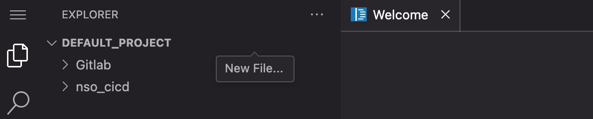
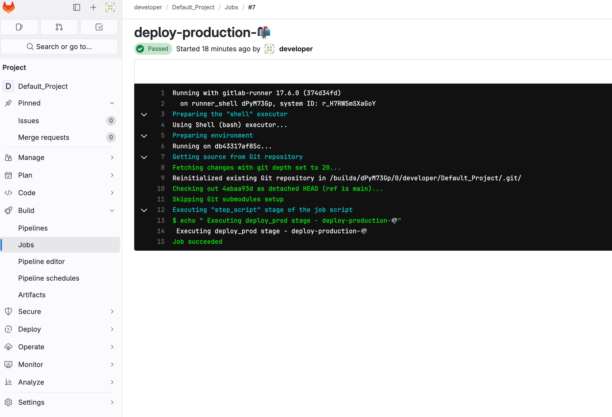
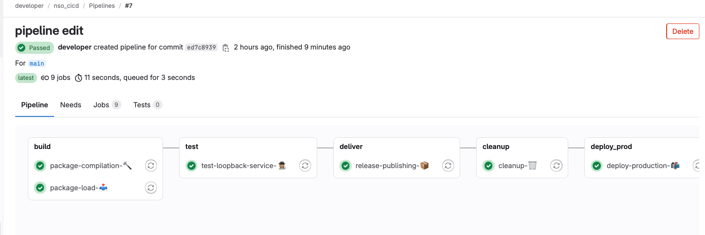

# Define the CI/CD pipeline

??? info "**REMINDER** - What is a Pipeline?"

    The CI/CD pipeline is responsible for validating changes made to files in the GitLab repository, running automated tests, and deploying code to production if all validations and tests pass.

    In GitLab, a pipeline is defined using a YAML file, often named `.gitlab-ci.yml`. This file specifies the tasks to be executed as part of the pipeline which can be organized into stages, such as `build`, `test`, and `deploy`, with specific task definitions for each stage.

    A pipeline can consist of various stages, each designed to perform specific actions. Examples of these actions include:

    * Building and compiling code or packages
    * Deploying to a test environment
    * Executing test cases to validate functionality
    * Cleaning up development environments
    * Deploying to production environments

    These actions are executed by 'runners' - in the sandbox we automatically register a runner for all projects, with most of the tools we need. In this task, we will follow a step-by-step process to create a pipeline tailored to our project.

In this project repository we will store our files and add a CI file which can be interpreted by GitLab and is the collection of stages and tasks that will make up our pipeline in the end. Next we will add our configuration template to our repository. Storing it centrally in the repo enables tracking of changes, collaborative work and rollback of commits if needed. After our files are set, we will create the CI file called `.gitlab-ci.yml`. Here we will describe the procedure of our pipeline.


### Task 1: Open the Web IDE

We're going to use the Web IDE to make changes - open up Default Project and select the Web IDE from the Edit dropdown.




!!! question ""

### Task 2: Create a new gitlab-ci file 

Next we will create the pipeline definition in the GitLab repository. This triggers an initial execution of the pipeline because we are adding the `.gitlab-ci.yml` file to the repo. No changes will be made to the network devices because we have not yet made any changes to the definition files. 




To save time we've provided an example pipeline below - copy and paste this into your new ci file.


```yaml linenums="1" title="Gitlab runner .gitlab-ci.yml"
# Define the stages of the pipeline
stages:
  - build
  - test
  - deliver
  - cleanup
  - deploy_prod

# Step to compile the package in the development NSO environment
package-compilation-🔨:
  stage: build
  script:
    - echo "Executing build stage - package-compilation-🔨"

# Step to load the compiled package into the testing NSO environment
package-load-📥:
  stage: build
  script:
    - echo "Executing build stage - package-load-📥"

# Step to test the loopback service in the NSO testing environment
test-loopback-service-🕵🏽:
  stage: test
  script:
    - echo "Executing test stage - test-loopback-service-🕵🏽"

# Step to generate and publish the release package
release-publishing-📦:
  stage: deliver
  script:
    - echo "Executing deliver stage - release-publishing-📦"

# Step to clean up the development environment
cleanup-🗑️:
  stage: cleanup
  script:
    - echo "Executing cleanup stage - cleanup-🗑️"

# Step to deploy the package to the production NSO environment
deploy-production-📬:
  stage: deploy_prod
  script:
    - echo " Executing deploy_prod stage - deploy-production-📬"
```
> **Note:** For more details on the pipeline configuration see the GitLab [documentation](https://docs.gitlab.com/ee/ci/yaml/) 
>

Commit your changes to the main branch by selecting the Source control icon on the left.

!!! question ""

### Task 3: Examine the pipeline job
---
Navigate to [http://devtools-gitlab.lab.devnetsandbox.local/developer/Default_Project/-/pipelines](http://devtools-gitlab.lab.devnetsandbox.local/developer/Default_Project/-/pipelines). The pipeline should pass, since no changes are being made. Also if you click on the passed indication in the Status column, you should see that only the Deploy_prod stage executed. This is because of the pipeline configuration in `.gitlab-ci.yml` which has except clauses on the test stages for the main branch.


To verify that the script was executed properly we enter to the job details.




To view detailed information about each stage, click on the `passed` button in the status column.

