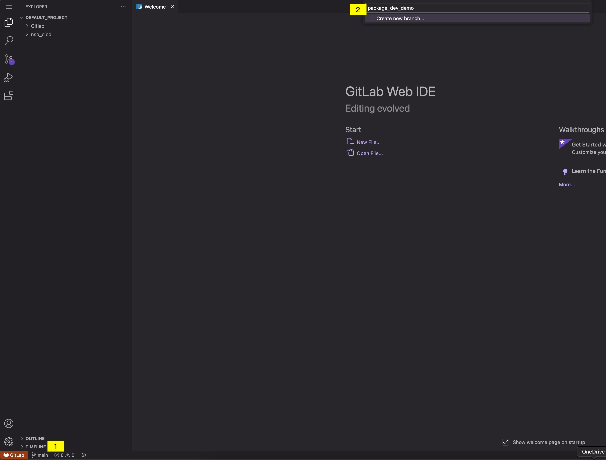
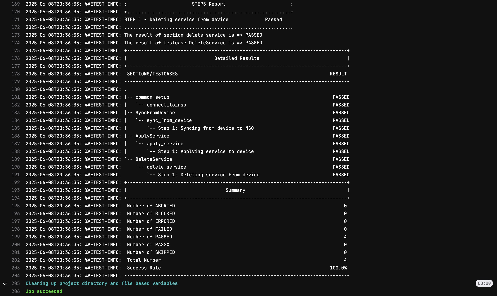

# Pipeline-Driven NSO Service Development

---

After understanding the concept of a pipeline and its stages, we'll move on to modifying the NSO package service in the `nso_cicd/packages/loopback` directory. Our GitLab CI/CD pipeline will automate the verification process by compiling the package and performing a compatibility (smoke) test with the current NSO version.

The pipeline will also automate the deployment of the package service in the NSO development environment and run tests using Python and PyATS. Once all pipeline stages complete successfully, you can confidently deploy the changes to the production environment.

## Task 3: Create a Test Branch

??? info "**Reminder:** What is a branch?"

    In Git, a branch is a lightweight, movable pointer to a commit. Branches allow you to create separate lines of development within a repository, enabling you to work on different features, bug fixes, or experiments simultaneously without affecting the main codebase. Branches are central to most version control workflows, making parallel development and collaboration easy. Developers can experiment and innovate without disrupting stable code.

    <div class="card" markdown>

    **Key Concepts:**

    - **Default Branch:** The main line of development, usually called `main` or `master`.
    - **Feature Development:** Create new branches for each feature, bug fix, or task. This isolates changes from the main branch until they're ready to be merged.
    - **Branch Creation:** Use `git branch` or `git checkout -b` to create and switch to a new branch.
    - **Switching Branches:** Use `git checkout` to switch between branches.
    - **Merging:** Once work is complete and tested, merge the branch back into another branch (typically `main`) using `git merge`.
    - **Collaboration:** Multiple developers can work on their own branches and merge changes into shared branches as needed.

    </div>

Creating a test branch allows you to make changes safely without impacting the production NSO service package stored in the main branch. By committing and pushing changes to this test branch in GitLab, the pipeline will automatically compile, test, and deploy the NSO package to the development environment and execute the test scripts. You can then review the pipeline's pass/fail status to ensure your changes are successful.



You should now have a new branch called `package_dev_demo` and be working on that branch.

## Task 4: Update the NSO Loopback Template

??? info  "**Reminder:** What is a template, and how is it different from a model?"

    YANG models and templates together enable full lifecycle management of network services—from design and deployment to monitoring and troubleshooting. This combination allows network operators to define services once and deploy them consistently across diverse network environments, scaling operations efficiently. YANG models and templates are integral to NSO's automation capabilities, allowing for rapid deployment and modification of network services, and reducing the need for manual intervention.

    <div class="card" markdown>

    **Key Concepts:**

    - **Configuration Generation:** Templates in NSO generate device-specific configuration snippets from the abstract service definitions provided by YANG models.
    - **Device-Specific Customization:** While YANG models define the abstract structure, templates handle the nuances of various device types and vendors, allowing NSO to push the correct configurations to different devices.
    - **Separation of Concerns:** Templates separate service logic from device-specific syntax, making maintenance and updates easier.
    - **Reusable Components:** Templates can be reused across different services, promoting consistency and reducing duplication.

    </div>

<div class="instruction" markdown>

To complete the development of the Loopback service and ensure all tests pass, modify the file `loopback-template.xml` located in `/nso_cicd/packages/loopback/templates`. Include the XML configurations as specified below, making sure they match exactly.

</div>

!!! question "Question: Why do we need to define different interface templates for IOS and IOS XR?"

```xml
<config-template xmlns="http://tail-f.com/ns/config/1.0"
                 servicepoint="loopback">  
  <devices xmlns="http://tail-f.com/ns/ncs">  
    <!-- DEVICE -->
    <device>  
      <name>{/device}</name>  
      <config>  
        <!-- IOS -->
        <interface xmlns="urn:ios"> 
          <Loopback> 
            <name>{/loopback-intf}</name>
            <ip> 
              <address> 
                <primary> 
                  <address>{/ip-address}</address>
                  <mask>255.255.255.255</mask> 
                </primary> 
              </address> 
            </ip> 
          </Loopback> 
        </interface> 
        <!-- IOS-XR -->
        <interface xmlns="http://tail-f.com/ned/cisco-ios-xr"> 
          <Loopback> 
            <id>{/loopback-intf}</id>
            <ipv4> 
              <address> 
                <ip>{/ip-address}</ip>
                <mask>255.255.255.255</mask> 
              </address> 
            </ipv4> 
          </Loopback> 
        </interface>  
      </config> 
    </device> 
  </devices> 
</config-template>
```

## Task 5: Update the GitLab Pipeline

Now it's time to make our pipeline actually do something! For this workshop, we'll use a pipeline to package an NSO loopback service, deploy it to the NSO development environment, and perform basic validation tests.

<div class="instruction" markdown>

To enhance practicality and efficiency, you can replace your CI file with the pipeline below and commit the changes. Don't worry too much about the details of each task; if we have time at the end, we can revisit the functions.

</div>

!!! question "Question: Which stages will run when making changes in our test pipeline?"

```yaml
# GitLab CI/CD Pipeline for NSO Package Deployment
#
# Workflow:
#   Feature Branch: build → test (compile, test, leave tarball on dev server)
#   Main Branch:    deliver → deploy (retrieve pre-built artifact, deploy to prod)
#
# IMPORTANT: Always run pipeline on feature/dev branch BEFORE merging to main!

include:
  - 'pipeline_utils/environments.yml'

stages:
  - build
  - test
  - deliver
  - deploy_feat
  - deploy_prod

variables:
  NSO_VERSION: "6.4.4"
  NSO_RC_PATH: "/opt/ncs/ncs-${NSO_VERSION}/ncsrc"
  NSO_RUN_PATH: "/nso/run"
  SSH_OPTS: "-o ConnectTimeout=10 -o ServerAliveInterval=5 -o ServerAliveCountMax=3 -o StrictHostKeyChecking=accept-new"

# Reusable job template
.base_job:
  before_script:
    - mkdir -p ~/.ssh && chmod 700 ~/.ssh
  timeout: 10 minutes

# Pre-requisites check
runner pre-reqs:
  stage: .pre
  extends: .base_job
  timeout: 5 minutes
  script:
    - python --version
    - command -v sshpass || (echo "sshpass not installed" && exit 1)
    - pipx install robotframework-sshlibrary --include-deps --force
    - sshpass -p "$NSO_DEV_PWD" ssh $SSH_OPTS $NSO_DEV_USER@$NSO_DEV_IP "echo 'OK'" || (echo "Dev unreachable" && exit 1)
    - sshpass -p "$NSO_PROD_PWD" ssh $SSH_OPTS $NSO_DEV_USER@$NSO_PROD_IP "echo 'OK'" || (echo "Prod unreachable" && exit 1)
  retry:
    max: 2
    when: [runner_system_failure, stuck_or_timeout_failure]

# Build: Compile NSO package
package-compilation:
  stage: build
  extends: .base_job
  timeout: 15 minutes
  rules:
    - if: $CI_COMMIT_BRANCH != "main"
  script:
    - 'test -n "$PACKAGE" || (echo "ERROR: PACKAGE is required" && exit 1)'
    - 'echo "Package: $PACKAGE | Commit: $CI_COMMIT_SHORT_SHA"'
    - sshpass -p "$NSO_DEV_PWD" scp $SSH_OPTS -r nso_cicd/packages/$PACKAGE $NSO_DEV_USER@$NSO_DEV_IP:/home/developer/$PACKAGE
    - |
      sshpass -p "$NSO_DEV_PWD" ssh $SSH_OPTS $NSO_DEV_USER@$NSO_DEV_IP "
        set -e && cd /home/developer/ &&
        cp -r $PACKAGE $NSO_RUN_PATH/packages/ &&
        source $NSO_RC_PATH &&
        cd $NSO_RUN_PATH/packages/$PACKAGE/src &&
        make clean && make &&
        cd $NSO_RUN_PATH/packages &&
        tar -czf /home/developer/nso-package_$PACKAGE.tar.gz $PACKAGE
      "
    - sshpass -p "$NSO_DEV_PWD" scp $SSH_OPTS $NSO_DEV_USER@$NSO_DEV_IP:/home/developer/nso-package_$PACKAGE.tar.gz .
  artifacts:
    paths: ["nso-package_*.tar.gz"]
    expire_in: 1 week
  retry:
    max: 2
    when: script_failure

# Build: Reload package in dev NSO
package-load:
  stage: build
  extends: .base_job
  rules:
    - if: $CI_COMMIT_BRANCH != "main"
  dependencies: [package-compilation]
  script:
    - 'test -n "$PACKAGE" || (echo "ERROR: PACKAGE is required" && exit 1)'
    - sshpass -p "$NSO_DEV_PWD" ssh $SSH_OPTS $NSO_DEV_USER@$NSO_DEV_IP "source $NSO_RC_PATH && echo 'packages reload' | ncs_cli -Cu admin"

# Test: Validate loopback service
test-loopback-service:
  stage: test
  extends: .base_job
  timeout: 20 minutes
  rules:
    - if: $CI_COMMIT_BRANCH != "main"
  dependencies: [package-load]
  script:
    - 'test -n "$PACKAGE" || (echo "ERROR: PACKAGE is required" && exit 1)'
    - cd nso_cicd/tests/loopback-test
    - python loopback-test.py --nso_url "http://$NSO_DEV_IP:8080" --device "dev-core-rtr01" --username "$NSO_DEV_USER" --password "$NSO_DEV_PWD" 2>&1 | tee test-xr.log
    - python loopback-test.py --nso_url "http://$NSO_DEV_IP:8080" --device "dev-dist-rtr01" --username "$NSO_DEV_USER" --password "$NSO_DEV_PWD" 2>&1 | tee test-ios.log
  after_script:
    - cd nso_cicd/tests/loopback-test && ls -lh *.log 2>/dev/null || echo "No log files generated"
  artifacts:
    when: always
    paths: [nso_cicd/tests/loopback-test/*.log]
    expire_in: 30 days
  retry:
    max: 1
    when: script_failure

# Deliver: Retrieve pre-tested artifact for production
prepare-production-artifact:
  stage: deliver
  extends: .base_job
  rules:
    - if: $CI_COMMIT_BRANCH == "main"
  script:
    - 'test -n "$PACKAGE" || (echo "ERROR: PACKAGE is required" && exit 1)'
    - sshpass -p "$NSO_DEV_PWD" scp $SSH_OPTS $NSO_DEV_USER@$NSO_DEV_IP:/home/developer/nso-package_$PACKAGE.tar.gz .
    - 'tar -tzf nso-package_$PACKAGE.tar.gz > /dev/null || (echo "ERROR: Corrupted tarball" && exit 1)'
    - 'tar -tzf nso-package_$PACKAGE.tar.gz | grep -E "\.(so|fxs)$" > /dev/null || echo "WARNING: No compiled binaries"'
  artifacts:
    paths: ["nso-package_*.tar.gz"]
    expire_in: 1 week

# Deploy: Production deployment (manual approval required)
deploy-to-production:
  stage: deploy_prod
  extends: .base_job
  timeout: 15 minutes
  rules:
    - if: $CI_COMMIT_BRANCH == "main"
      when: manual
      allow_failure: true
  dependencies: [prepare-production-artifact]
  resource_group: production-nso
  environment:
    name: production
  script:
    - 'test -n "$PACKAGE" || (echo "ERROR: PACKAGE is required" && exit 1)'
    - sshpass -p "$NSO_PROD_PWD" scp $SSH_OPTS nso-package_$PACKAGE.tar.gz $NSO_DEV_USER@$NSO_PROD_IP:/home/developer/
    - |
      sshpass -p "$NSO_PROD_PWD" ssh $SSH_OPTS $NSO_DEV_USER@$NSO_PROD_IP "
        set -e && cd /home/developer/ &&
        tar -xzf nso-package_$PACKAGE.tar.gz &&
        [ -d \"$NSO_RUN_PATH/packages/loopback\" ] && mv $NSO_RUN_PATH/packages/loopback $NSO_RUN_PATH/packages/loopback.backup.\$(date +%Y%m%d_%H%M%S) || true &&
        cp -r $PACKAGE $NSO_RUN_PATH/packages/loopback &&
        source $NSO_RC_PATH &&
        echo 'packages reload' | ncs_cli -Cu admin &&
        echo 'show packages package $PACKAGE oper-status' | ncs_cli -Cu admin &&
        rm -f nso-package_$PACKAGE.tar.gz
      "

# Post-deployment verification
verify-production-deployment:
  stage: .post
  extends: .base_job
  rules:
    - if: $CI_COMMIT_BRANCH == "main"
      when: on_success
  needs: [deploy-to-production]
  script:
    - 'test -n "$PACKAGE" || (echo "ERROR: PACKAGE is required" && exit 1)'
    - |
      sshpass -p "$NSO_PROD_PWD" ssh $SSH_OPTS $NSO_DEV_USER@$NSO_PROD_IP "
        source $NSO_RC_PATH &&
        echo 'show packages package $PACKAGE oper-status' | ncs_cli -Cu admin | grep -q 'up' &&
        echo '✅ Package operational in production'
      "

# Cleanup dev environment (feature branches only) — disabled
# cleanup-dev-environment:
#   stage: .post
#   extends: .base_job
#   timeout: 5 minutes
#   allow_failure: true
#   rules:
#     - if: $CI_COMMIT_BRANCH != "main"
#       when: always
#   script:
#     - test -n "$PACKAGE" || (echo "ERROR: PACKAGE is required" && exit 1)
#     - |
#       sshpass -p "$NSO_DEV_PWD" ssh $SSH_OPTS $NSO_DEV_USER@$NSO_DEV_IP "
#         rm -rf /home/developer/$PACKAGE /home/developer/nso-package_$PACKAGE.tar.gz $NSO_RUN_PATH/packages/$PACKAGE &&
#         source $NSO_RC_PATH && echo 'packages reload force' | ncs_cli -Cu admin
#       " || echo "Cleanup had issues (non-fatal)"
```

> **Note:** For more details on the pipeline configuration, see the GitLab [documentation](https://docs.gitlab.com/ee/ci/yaml/){:target="_blank"}.

<div class="instruction" markdown>

Navigate to [NSO CI/CD Pipelines](http://devtools-gitlab.lab.devnetsandbox.local/developer/nso_cicd/-/pipelines){:target="_blank"} to view the status of the pipeline.

</div>

This process may take a few minutes to complete. While the stages are running, review the completed ones to see what is happening.

!!! question "What was the outcome of the testing phase?"

!!! question "Is the loopback service available in the development NSO instance?"



---
